# Movie Booking System

## Demo
### Link aplicatie: https://movie-booking-app-loxm.onrender.com/movies

### Conturi de test

**Utilizator ADMIN**
- username: admin
- password: parola

**Utilizator normal (rol USER)**
- username: testy
- password: parola

**Se pot crea utilizatori cu rol USER in pagina `/register`: https://movie-booking-app-loxm.onrender.com/register**

## 1. Descrierea proiectului
- Ce face aplicatia: sistem de rezervare bilete cinema, cu gestiune
  filme/cinematografe/sali/rezervari, autentificare cu roluri.
- Tehnologii folosite: Spring Boot, Spring Data JPA, Spring Security,
  Thymeleaf, PostgreSQL, H2, JUnit5/Mockito, Docker.
- Deployment: Render free tier
  
## 2. Business Requirements
1.  **Inregistrare Useri:** Utilizatorii pot crea un cont cu nume, email, parola.
2.  **Catalog Filme:** Afisarea publica filmelor, inclusiv detalii (Genre, Rating).
3.  **Management Cinema, Filme si Ecrane:** Administratorii pot gestiona/adauga/sterge Cinematografe, Sali si Filme.
4.  **Screening Schedule:** Se pot inregistra rulari diferite ale aceluiasi film (in zile/ore/locatii diferite).
5.  **Disponibilitate Locuri:** Se verifica daca in momentul rezervarii locul dorit este disponibil.
6.  **Concurrency Control:** Un scaun nu poate fi rezervat simultan de catre doi utilizatori diferiti.
7.  **Booking Multiplu:** Se pot rezerva mai multe locuri in aceeasi tranzactie.
8.  **Calcul Cost:** Se calculeaza automat pretul total pentru o tranzactie cu mai multe locuri(scaune).
9.  **Istoric Booking:** Utilizatorii pot vizualiza istoricul rezervarilor.
10. **Filme Favorite:** Utilizatorii pot marca filme drept "Favorit".

## 3. Arhitectura
### Diagrama ERD

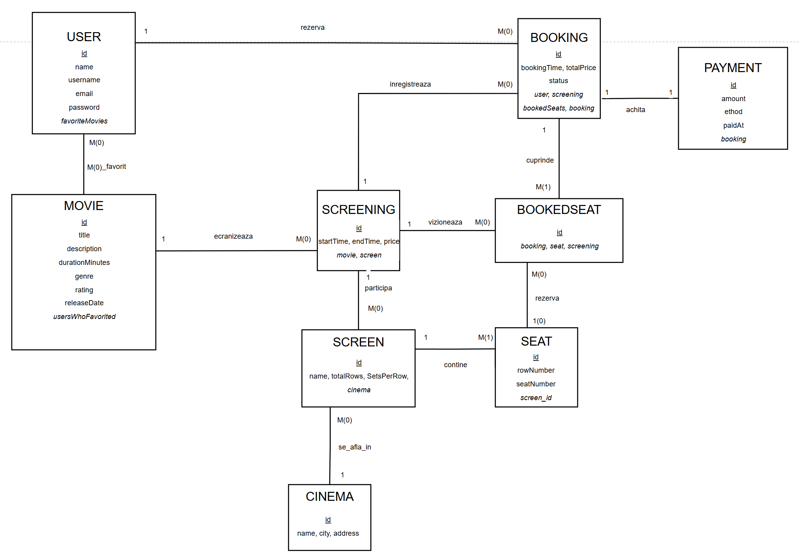

### Descrierea entitatilor
* **User** - cont utilizator, cu rol (USER/ADMIN)
    - Movie - filmele disponibile
    - Cinema - locatiile fizice
    - Screen - salile dintr-un cinema
    - Seat - locurile dintr-o sala (generate automat)
    - Screening - o proiectie (film + sala + ora + pret)
    - Booking - o rezervare (user + screening + locuri)
    - BookedSeat - asociere booking-seat-screening
    - Payment - plata asociata unei rezervari (OneToOne cu Booking)
* **Relatii**:
    - User <-> Movie: @ManyToMany (favorite movies)
    - Booking <-> Payment: @OneToOne
    - Cinema -> Screen: @OneToMany / Screen → Cinema: @ManyToOne
    - Screen -> Seat: @OneToMany / Seat → Screen: @ManyToOne
    - Movie -> Screening: @OneToMany / Screening → Movie: @ManyToOne
    - Screening -> Screen: @ManyToOne
    - Booking -> User: @ManyToOne, Booking → Screening: @ManyToOne
    - BookedSeat -> Booking/Seat/Screening: @ManyToOne (x3)

Aplicatia respecta separarea clasica pe 3 straturi: 
* **Controller** (primeste request-urile HTTP, returneaza raspunsuri, fara logica de business)

* **Service** (contine logica de business — validari, calcule, operatii intre entitati)
* **Repository** (interfete Spring Data
JPA responsabile exclusiv de accesul la baza de date, fara logica suplimentara).

Pentru fiecare entitate exista un `@RestController` (expune API REST,
folosit pentru integrari externe/Postman) si, pentru entitatile principale
(Movie, Cinema, User), un `@Controller` separat (randare Thymeleaf), ambele apeland
același `Service` — astfel logica de business ramane centralizata intr-un
singur loc, indiferent de canalul de acces (JSON sau HTML). Exceptiile
specifice fiecarei operatii (ex. `MovieNotFoundException`, `SeatAlreadyBookedException`)
sunt tratate centralizat printr-un `@ControllerAdvice` (`GlobalExceptionHandler`),
care mapeaza fiecare tip de exceptie la codul HTTP corespunzator.

### 4. Setup instructions
- Cerinte: Java 21, Maven, PostgreSQL instalat local (sau Docker)
- Pasi:
    1. Clone repo
    2. Creeaza DB `cinema_db` in Postgres
    3. Completeaza `application-dev.yml` cu credentiale
    4. `mvn clean install`
    5. `mvn spring-boot:run -Dspring-boot.run.profiles=dev`
    6. Aplicatia porneste pe `http://localhost:8080`

### 5. API Documentation

| Method | Endpoint | Descriere                                | Rol necesar |
|--------|----------|------------------------------------------|-------------|
| POST | `/api/auth/register` | Inregistrare user nou                    | Public |
| POST | `/api/auth/login` | Autentificare (test API)                 | Public |
| GET | `/api/movies` | Lista filme                              | Public |
| GET | `/api/movies/{id}` | Detalii film                             | Public |
| GET | `/api/movies/search?query=` | Cautare filme dupa titlu                 | Public |
| POST | `/api/movies` | Adauga film nou                          | ADMIN |
| PUT | `/api/movies/{id}` | Actualizeaza film                        | ADMIN |
| DELETE | `/api/movies/{id}` | Sterge film                              | ADMIN |
| GET | `/api/cinemas` | Lista cinematografe                      | Public |
| POST | `/api/cinemas` | Adauga cinema                            | ADMIN |
| POST | `/api/screens` | Adauga sala (genereaza automat locurile) | ADMIN |
| GET | `/api/cinemas/{id}/screens` | Lista sali dintr-un cinema               | Public |
| POST | `/api/screenings` | Publica o proiectie noua                 | ADMIN |
| GET | `/api/screenings/movie/{movieId}` | Proiectii disponibile pentru un film     | Public |
| POST | `/api/bookings` | Creeaza o rezervare                      | USER |
| GET | `/api/bookings` | Lista toate rezervarile                  | ADMIN |
| GET | `/api/bookings/{id}` | Detalii rezervare                        | USER/ADMIN |
| GET | `/api/bookings/users/{userId}` | Istoric rezervari per user               | USER |
| PATCH | `/api/bookings/{id}/status` | Schimba status (ex. anulare)           | USER |
| DELETE | `/api/bookings/{id}` | Sterge rezervare                         | ADMIN |
| POST | `/api/payments` | Inregistreaza o plata                    | ADMIN |
| GET | `/api/payments` | Lista plati                              | ADMIN |
| GET | `/api/payments/{id}` | Detalii plata                            | ADMIN |

### Interfată web (Thymeleaf)

| Rută | Descriere                                      | Acces |
|------|------------------------------------------------|-------|
| `/movies` | Lista filme (paginare, sortare, favorite)      | Public |
| `/movies/new`, `/movies/edit/{id}` | Adauga/editeaza film                           | ADMIN |
| `/movies/{id}/screenings` | Proiectii disponibile pentru un film           | Public |
| `/cinemas` | Lista cinema (paginare, sortare)               | Public/ADMIN |
| `/login`, `/register` | Autentificare / cont nou                       | Public |
| `/profile` | Date cont + rezervari proprii + filme favorite | USER |

## Screenshots
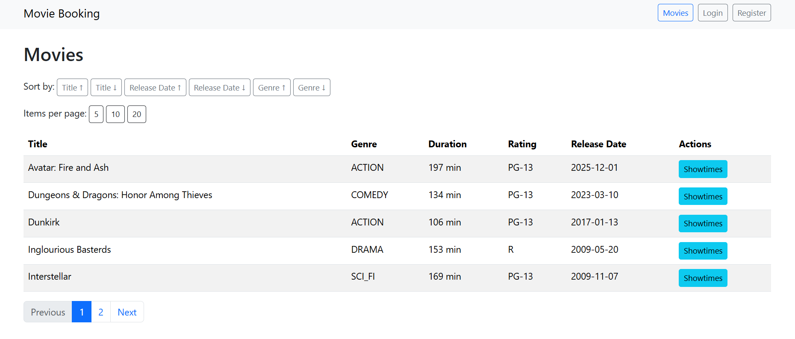
**Lista filme, fara a fi logat:** Lista publica a filmelor inregistrate, plus detalii. Paginare, sortare disponibile

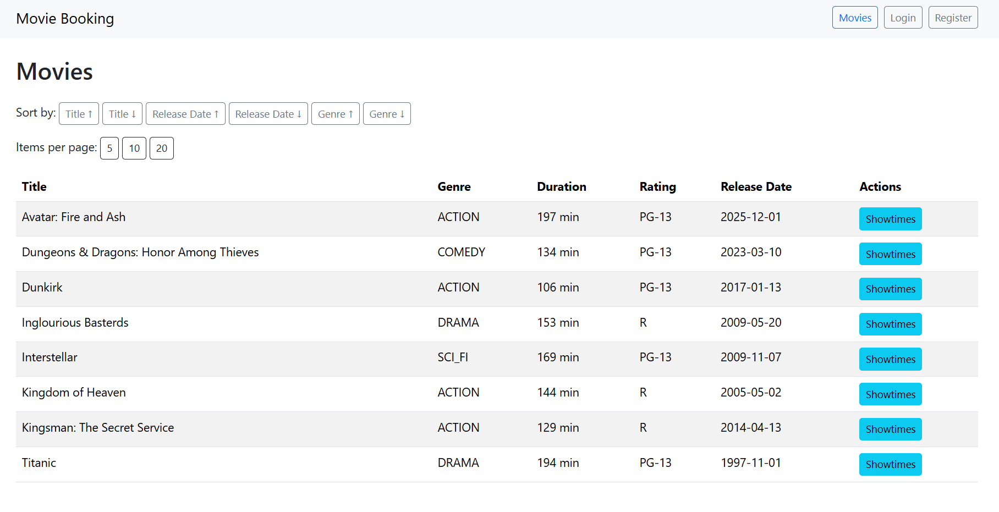
**Lista filme, fara a fi logat:** A fost modificata dimensiunea paginii de la 5 la 10 elemente

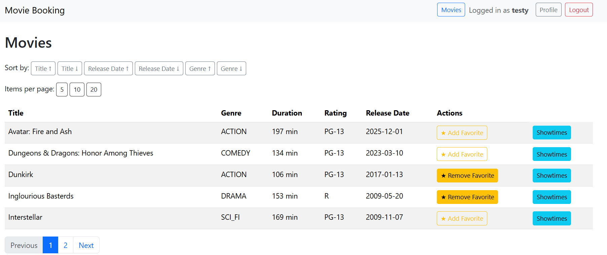!
**Lista filme, logat ca USER normal:** Lista publica, la care se adauga optiunea de a marca filme ca "Favorit"

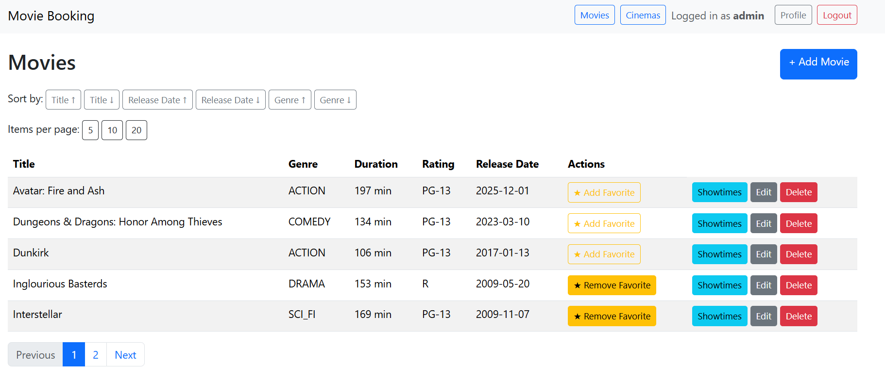
**Lista filme, logat ca ADMIN:** ADMIN-ul poate adauga, modifica si sterge filme, pe langa optiunile unui utilizator obisnuit.

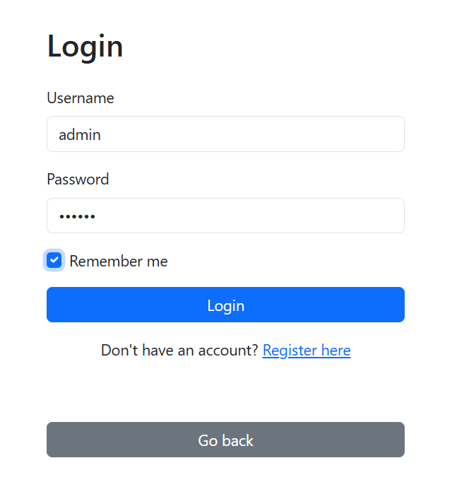
**Pagina de Login:** Include optiunea de Remember me, cu durata de 24h

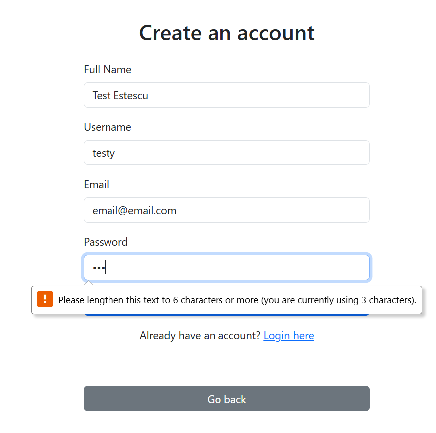 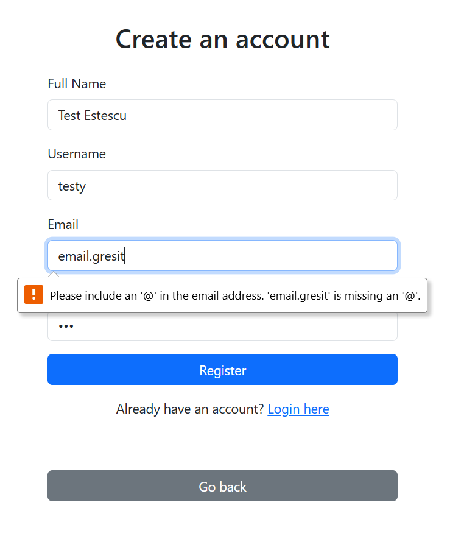
**Pagina de Register:** Include validarea datelor

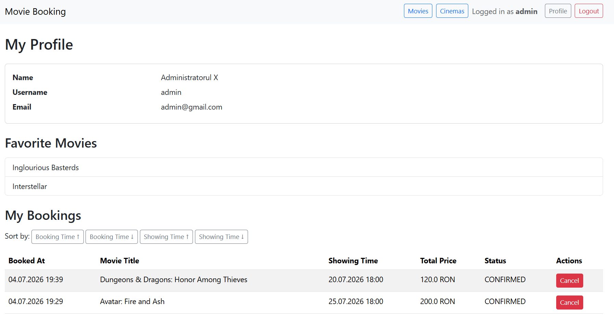
**Profilul Utilizatorului:** Include datele personale, filme Favorite, istoricul rezervarilor

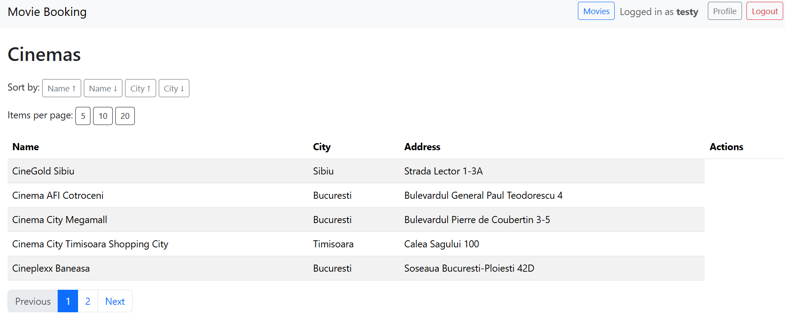
**Lista cinematografe, utilizator simplu:** 

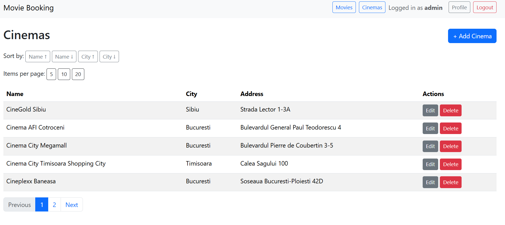
**Lista cinematografe, logat ca ADMIN:** ADMIN-ul poate adauga, modifica si sterge cinematografe, pe langa optiunile publice

Exemplu logging
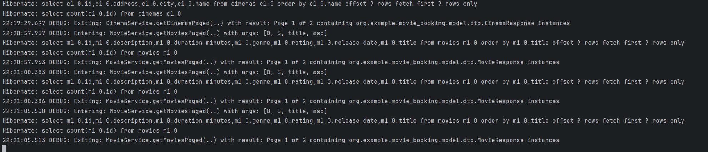

Rulare teste:
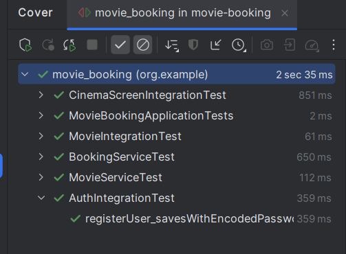
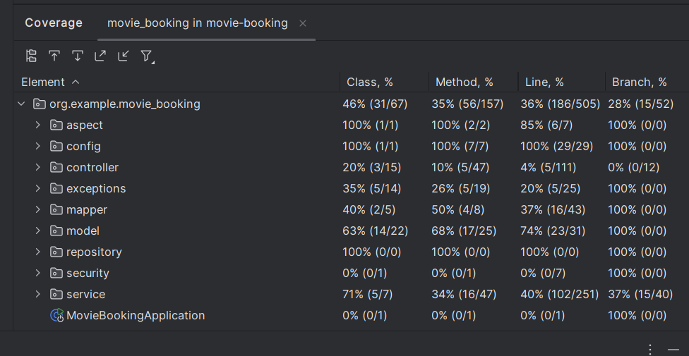

Link aplicatie: https://movie-booking-app-loxm.onrender.com/movies
